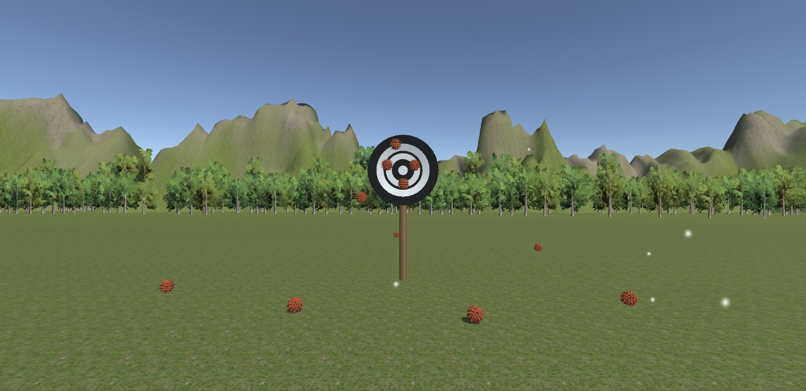

# Bamsongi_Game
 
## 기획

- 주제 : 밤송이를 날리는 게임
- 내용 :
    - 화면을 탬하면 밤송이가 날아감
    - 과녁이 있다. 밤송이가 달라붙고 이펙트가 표시됨
- 리소스 :
    1. 오브젝트 : 밤송이, 과녁, 나무, 지면
    2. 컨트롤러 스크립트 : 밤송이 컨트롤러
    3. 제네레이터 스크립트 : 밤송이 제네레이터
    4. 감독 스크립트 : x
    5. 흐름 : 컨트롤러 -> 제네레이터

## 계획

- 버전1  
    